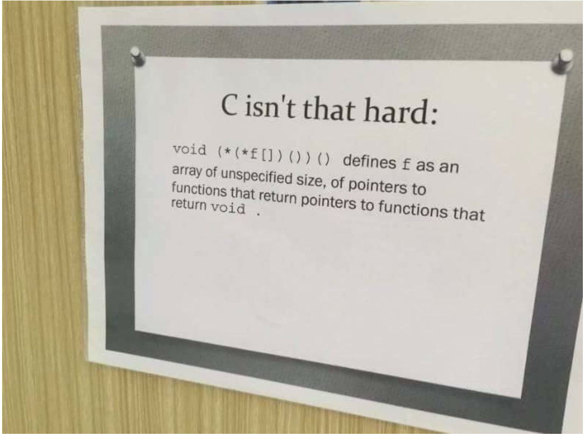

# C - Pointers, arrays and strings
  

0. A function that takes a pointer to an _int_ as parameter and updates the value it points to to _98_.

1. A function that swaps the values of two integers.

2. A function that returns the length of a string.

3. A function that prints a string, followed by a new line, to _stdout_.

4. A function that prints a string, in reverse, followed by a new line.

5. A function that reverses a string.

6. A function that prints every even indexed character of a string, starting with the first character, followed by a new line.

7. A function that prints half of a string, followed by a new line.

8. A function that prints _n_ elements of an array of integers, followed by a new line.
