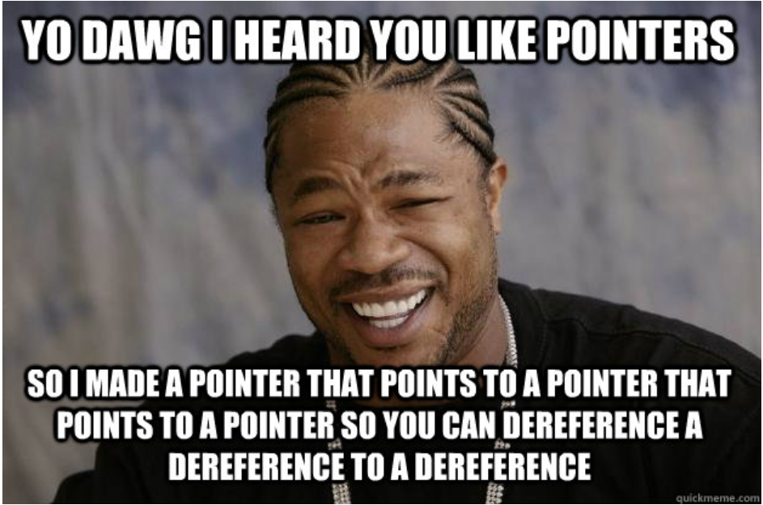

# C - Even more pointers, arrays and strings
  

**The following are functions the implement pointers, arrays and strings:**

0. Fills memory with a constant byte.

1. Copies memory area.

2. Locates a character in a string.

3. Gets the length of a prefix substring.

4. Searches a string for any of a set of bytes.

5. Locates a substring.
