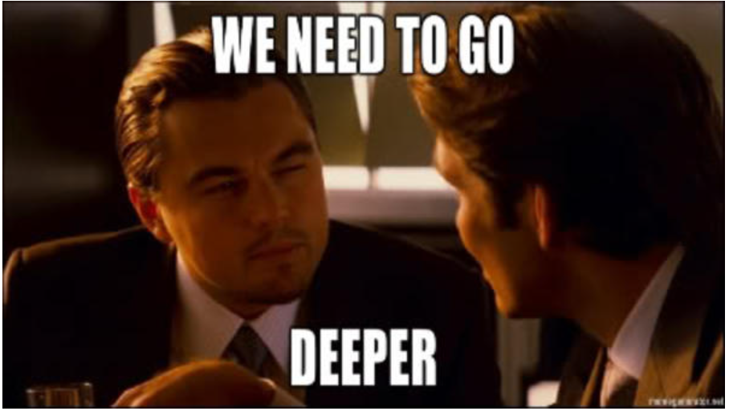

# C - Recursion
  

**The following functions implement the recursion concept:**

0. Priints a string, followed by a new line.

1. Prints a string in reverse.

2. Returns the length of a string.

3. Returns the factorial of a given number.

4. Returns the value of _x_ raised to the power of _y_.

5. Returns the natural square root of a number.

6. Returns _1_ if the input integer is a prime number, otherwise return _0_.
